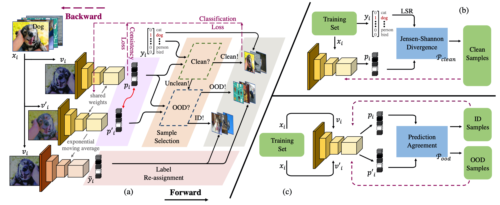

Introduction
---
The source code and models for our paper **Jo-SRC: A Contrastive Approach for Combating Noisy Labels**


Framework
---



Installation
---
After creating a virtual environment of python 3.6, run `pip install -r requirements.txt` to install all dependencies


How to use
---
The code is currently tested only on GPU.

- Data preparation

    Created a folder `Datasets` and download `cifar100`/`clothing1m`/`food101n` dataset into this folder.


- Source code
    - If you want to train the whole model from beginning using the source code, please follow subsequent steps:
        - Prepare data
        - Modify GPU device in the corresponding train script `xxx.sh` in `scripts` folder
        - Activate virtual environment (e.g. conda) and then run
        ```
        bash scripts/xxx.sh
        ```


- Demo
    - If you just want to do a quick test on the model, please follow subsequent steps:
      - Prepare data
      - Download one of the following trained model
        ```
        wget https://josrc.oss-cn-shanghai.aliyuncs.com/clothing1m_r18_71.78.pth
        wget https://josrc.oss-cn-shanghai.aliyuncs.com/food101n_r50_86.66.pth
        ```
      - Modify `GPU`, `ARCH`, `MODEL`, `DATASET`, and `NCLASSES` accordingly in the demo script `demo.sh` in `scripts` folder
      - Activate virtual environment (e.g. conda) and then run
        ```
        bash scripts/demo.sh
        ```